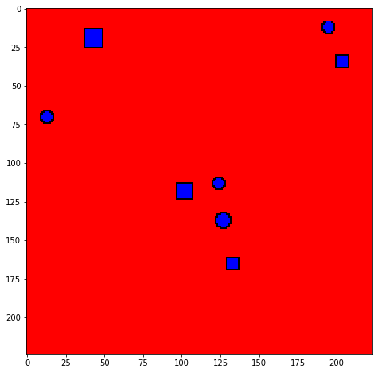
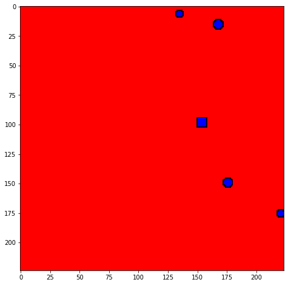

```python
import os
from PIL import Image, ImageDraw
import numpy as np
from shapely.geometry import box
import matplotlib.pyplot as plt

import tensorflow as tf

from tensorflow.keras.applications import MobileNetV2
from tensorflow.keras.models import load_model, Model
from tensorflow.keras.layers import Dense, Dropout, Flatten, MaxPool2D, BatchNormalization, LeakyReLU, Conv2D
from tensorflow.keras.callbacks import EarlyStopping, ReduceLROnPlateau, ModelCheckpoint

print(tf.__version__)
```


```python
def get_num_objects(mult):
    return int(np.round(np.abs(np.random.randn() * mult)))
    
def get_random_xy(img_size, margin = 0):
    x = np.random.randint(margin, img_size[0] - margin + 1)
    y = np.random.randint(margin, img_size[1] - margin + 1)   
    return (x, y)

def get_random_radius(radius, mult = 1):
    r = radius + int(np.random.randn() * mult)
    if r < 2: r = 2    
    if r > 10: r = 10
    return r


def draw_object(draw, img_size, num_objects, object_boxes = [], circle=True, radius_avg = 4, mult_radius = 1.2, fill_color='blue', outline_color ='black'):
    
    #print("Object Boxes", object_boxes)
    
    for c in range(num_objects):

        placed = False
        tries = 0

        while (tries < 3) and (placed == False):
            radius = get_random_radius(radius_avg, mult = mult_radius)
            center = get_random_xy(img_size, margin = radius)
            box_coords = (center[0] - radius, center[1] - radius, center[0] + radius, center[1] + radius)

            intersection_found = False

            for other in object_boxes:
                if box(box_coords[0], box_coords[1], box_coords[2], box_coords[3]).intersects(box(other[0]-1, other[1]-1, other[2]+1, other[3]+1)):
                    intersection_found = True
                    break

            tries += 1

            if intersection_found:
                continue
            else:
                object_boxes.append(box_coords)
                if circle: 
                    draw.ellipse(box_coords, fill=fill_color, outline=outline_color)
                else:
                    draw.rectangle(box_coords, fill=fill_color, outline=outline_color)
                    
                placed = True
                
    return object_boxes


def get_rand_color():
    return np.random.choice(['red', 'blue', 'yellow', 'black'])


def generate_new_image(batch_size = 4, radius_avg = 4, mult_radius = 1.2, img_size = (224, 224), mult_num_circles = 3, disp_img = False):
    
    while True:
        img_batch = []
        label_batch = []

        for bs in range(batch_size):
            img = Image.new('RGB', img_size, color = 'red')
            draw = ImageDraw.Draw(img)
            object_boxes = []
            mult_num_circles_new = mult_num_circles + 2 * int(np.random.randn())

            num_circles = get_num_objects(mult_num_circles_new)
            object_boxes = draw_object(draw, img_size, num_circles, object_boxes = object_boxes, circle=True, radius_avg=radius_avg, mult_radius=mult_radius)
            actual_num_circles = len(object_boxes)
                
            num_squares = get_num_objects(mult_num_circles_new)
            draw_object(draw, img_size, num_squares, object_boxes = object_boxes, circle=False, radius_avg=radius_avg, mult_radius=mult_radius)
            
            img_arr = np.array(img) / 255.

            if disp_img: plt.imshow(img)

            img_batch.append(img_arr)
            label_batch.append([actual_num_circles])

            
        img_batch = np.array(img_batch)
        label_batch = np.array(label_batch)
        
        #print(img_batch.shape, label_batch.shape)
        yield (img_batch, label_batch)


generator = generate_new_image()

    
ib, lb = next(generator)

print(ib.shape, lb.shape)
ib, lb = next(generator)
ib, lb = next(generator)
img = ib[1]
fig, ax = plt.subplots(figsize=(8, 8))
idx = np.argmax(lb)
ax.imshow(ib[idx])
num_circles = lb
img.shape, num_circles


```

    (4, 224, 224, 3) (4, 1)
    


    ((224, 224, 3),
     array([[0],
            [4],
            [1],
            [3]]))





```python
def create_model(printSummary = False):

    features_model = MobileNetV2(alpha=0.35, input_shape = (224, 224, 3), include_top = False)

    inputs = features_model.input
    x = features_model.output
    
    #x = MaxPool2D((3, 3))(features_model.output)
    x = BatchNormalization(name='MyBatchNorm_1')(x)
    #x = MaxPool2D((2, 2))(features_model.output)
    x = Conv2D(64, (1, 1), activation ='relu', name='MyConv_1')(x)
    x = Flatten()(x)
    x = Dense(64, activation ='relu', name='MyDense_1', kernel_regularizer=tf.keras.regularizers.l2(0.001))(x)
    #x = LeakyReLU()(x)
#     x = Dropout(0.3)(x)
#     x = BatchNormalization(name='MyBatchNorm_2')(x)
#     x = Dense(64, activation ='relu', name='MyDense_2', kernel_regularizer=tf.keras.regularizers.l2(0.001))(x)
    #x = LeakyReLU()(x)
    x = Dropout(0.3)(x)
    x = BatchNormalization(name='MyBatchNorm_3')(x)
    x = Dense(32, activation ='relu', name='MyDense_3', kernel_regularizer=tf.keras.regularizers.l2(0.001))(x)
    #x = LeakyReLU()(x)
    x = Dropout(0.3)(x)
    x = BatchNormalization(name='MyBatchNorm_4')(x)
    outputs = Dense(1,  activation='relu',name='MyDense_4', kernel_regularizer=tf.keras.regularizers.l2(0.001), bias_regularizer=tf.keras.regularizers.l2(0.001))(x)
    
    model = Model(inputs = inputs, outputs = outputs)

    print(len(features_model.layers), len(model.layers))
    
    for i in range(len(features_model.layers)):
        model.layers[i].trainable = False


    model.compile(optimizer = 'adam', loss = 'mse', metrics = ['mae'])

    if printSummary: print(model.summary())
    
    return model


model = create_model(printSummary=True)
```

    155 165
    Model: "model_17"
    __________________________________________________________________________________________________
    Layer (type)                    Output Shape         Param #     Connected to                     
    ==================================================================================================
    input_20 (InputLayer)           [(None, 224, 224, 3) 0                                            
    __________________________________________________________________________________________________
    Conv1_pad (ZeroPadding2D)       (None, 225, 225, 3)  0           input_20[0][0]                   
    __________________________________________________________________________________________________
    Conv1 (Conv2D)                  (None, 112, 112, 16) 432         Conv1_pad[0][0]                  
    __________________________________________________________________________________________________
    bn_Conv1 (BatchNormalization)   (None, 112, 112, 16) 64          Conv1[0][0]                      
    __________________________________________________________________________________________________
    Conv1_relu (ReLU)               (None, 112, 112, 16) 0           bn_Conv1[0][0]                   
    __________________________________________________________________________________________________
    expanded_conv_depthwise (Depthw (None, 112, 112, 16) 144         Conv1_relu[0][0]                 
    __________________________________________________________________________________________________
    expanded_conv_depthwise_BN (Bat (None, 112, 112, 16) 64          expanded_conv_depthwise[0][0]    
    __________________________________________________________________________________________________
    expanded_conv_depthwise_relu (R (None, 112, 112, 16) 0           expanded_conv_depthwise_BN[0][0] 
    __________________________________________________________________________________________________
    expanded_conv_project (Conv2D)  (None, 112, 112, 8)  128         expanded_conv_depthwise_relu[0][0
    __________________________________________________________________________________________________
    expanded_conv_project_BN (Batch (None, 112, 112, 8)  32          expanded_conv_project[0][0]      
    __________________________________________________________________________________________________
    block_1_expand (Conv2D)         (None, 112, 112, 48) 384         expanded_conv_project_BN[0][0]   
    __________________________________________________________________________________________________
    block_1_expand_BN (BatchNormali (None, 112, 112, 48) 192         block_1_expand[0][0]             
    __________________________________________________________________________________________________
    block_1_expand_relu (ReLU)      (None, 112, 112, 48) 0           block_1_expand_BN[0][0]          
    __________________________________________________________________________________________________
    block_1_pad (ZeroPadding2D)     (None, 113, 113, 48) 0           block_1_expand_relu[0][0]        
    __________________________________________________________________________________________________
    block_1_depthwise (DepthwiseCon (None, 56, 56, 48)   432         block_1_pad[0][0]                
    __________________________________________________________________________________________________
    block_1_depthwise_BN (BatchNorm (None, 56, 56, 48)   192         block_1_depthwise[0][0]          
    __________________________________________________________________________________________________
    block_1_depthwise_relu (ReLU)   (None, 56, 56, 48)   0           block_1_depthwise_BN[0][0]       
    __________________________________________________________________________________________________
    block_1_project (Conv2D)        (None, 56, 56, 8)    384         block_1_depthwise_relu[0][0]     
    __________________________________________________________________________________________________
    block_1_project_BN (BatchNormal (None, 56, 56, 8)    32          block_1_project[0][0]            
    __________________________________________________________________________________________________
    block_2_expand (Conv2D)         (None, 56, 56, 48)   384         block_1_project_BN[0][0]         
    __________________________________________________________________________________________________
    block_2_expand_BN (BatchNormali (None, 56, 56, 48)   192         block_2_expand[0][0]             
    __________________________________________________________________________________________________
    block_2_expand_relu (ReLU)      (None, 56, 56, 48)   0           block_2_expand_BN[0][0]          
    __________________________________________________________________________________________________
    block_2_depthwise (DepthwiseCon (None, 56, 56, 48)   432         block_2_expand_relu[0][0]        
    __________________________________________________________________________________________________
    block_2_depthwise_BN (BatchNorm (None, 56, 56, 48)   192         block_2_depthwise[0][0]          
    __________________________________________________________________________________________________
    block_2_depthwise_relu (ReLU)   (None, 56, 56, 48)   0           block_2_depthwise_BN[0][0]       
    __________________________________________________________________________________________________
    block_2_project (Conv2D)        (None, 56, 56, 8)    384         block_2_depthwise_relu[0][0]     
    __________________________________________________________________________________________________
    block_2_project_BN (BatchNormal (None, 56, 56, 8)    32          block_2_project[0][0]            
    __________________________________________________________________________________________________
    block_2_add (Add)               (None, 56, 56, 8)    0           block_1_project_BN[0][0]         
                                                                     block_2_project_BN[0][0]         
    __________________________________________________________________________________________________
    block_3_expand (Conv2D)         (None, 56, 56, 48)   384         block_2_add[0][0]                
    __________________________________________________________________________________________________
    block_3_expand_BN (BatchNormali (None, 56, 56, 48)   192         block_3_expand[0][0]             
    __________________________________________________________________________________________________
    block_3_expand_relu (ReLU)      (None, 56, 56, 48)   0           block_3_expand_BN[0][0]          
    __________________________________________________________________________________________________
    block_3_pad (ZeroPadding2D)     (None, 57, 57, 48)   0           block_3_expand_relu[0][0]        
    __________________________________________________________________________________________________
    block_3_depthwise (DepthwiseCon (None, 28, 28, 48)   432         block_3_pad[0][0]                
    __________________________________________________________________________________________________
    block_3_depthwise_BN (BatchNorm (None, 28, 28, 48)   192         block_3_depthwise[0][0]          
    __________________________________________________________________________________________________
    block_3_depthwise_relu (ReLU)   (None, 28, 28, 48)   0           block_3_depthwise_BN[0][0]       
    __________________________________________________________________________________________________
    block_3_project (Conv2D)        (None, 28, 28, 16)   768         block_3_depthwise_relu[0][0]     
    __________________________________________________________________________________________________
    block_3_project_BN (BatchNormal (None, 28, 28, 16)   64          block_3_project[0][0]            
    __________________________________________________________________________________________________
    block_4_expand (Conv2D)         (None, 28, 28, 96)   1536        block_3_project_BN[0][0]         
    __________________________________________________________________________________________________
    block_4_expand_BN (BatchNormali (None, 28, 28, 96)   384         block_4_expand[0][0]             
    __________________________________________________________________________________________________
    block_4_expand_relu (ReLU)      (None, 28, 28, 96)   0           block_4_expand_BN[0][0]          
    __________________________________________________________________________________________________
    block_4_depthwise (DepthwiseCon (None, 28, 28, 96)   864         block_4_expand_relu[0][0]        
    __________________________________________________________________________________________________
    block_4_depthwise_BN (BatchNorm (None, 28, 28, 96)   384         block_4_depthwise[0][0]          
    __________________________________________________________________________________________________
    block_4_depthwise_relu (ReLU)   (None, 28, 28, 96)   0           block_4_depthwise_BN[0][0]       
    __________________________________________________________________________________________________
    block_4_project (Conv2D)        (None, 28, 28, 16)   1536        block_4_depthwise_relu[0][0]     
    __________________________________________________________________________________________________
    block_4_project_BN (BatchNormal (None, 28, 28, 16)   64          block_4_project[0][0]            
    __________________________________________________________________________________________________
    block_4_add (Add)               (None, 28, 28, 16)   0           block_3_project_BN[0][0]         
                                                                     block_4_project_BN[0][0]         
    __________________________________________________________________________________________________
    block_5_expand (Conv2D)         (None, 28, 28, 96)   1536        block_4_add[0][0]                
    __________________________________________________________________________________________________
    block_5_expand_BN (BatchNormali (None, 28, 28, 96)   384         block_5_expand[0][0]             
    __________________________________________________________________________________________________
    block_5_expand_relu (ReLU)      (None, 28, 28, 96)   0           block_5_expand_BN[0][0]          
    __________________________________________________________________________________________________
    block_5_depthwise (DepthwiseCon (None, 28, 28, 96)   864         block_5_expand_relu[0][0]        
    __________________________________________________________________________________________________
    block_5_depthwise_BN (BatchNorm (None, 28, 28, 96)   384         block_5_depthwise[0][0]          
    __________________________________________________________________________________________________
    block_5_depthwise_relu (ReLU)   (None, 28, 28, 96)   0           block_5_depthwise_BN[0][0]       
    __________________________________________________________________________________________________
    block_5_project (Conv2D)        (None, 28, 28, 16)   1536        block_5_depthwise_relu[0][0]     
    __________________________________________________________________________________________________
    block_5_project_BN (BatchNormal (None, 28, 28, 16)   64          block_5_project[0][0]            
    __________________________________________________________________________________________________
    block_5_add (Add)               (None, 28, 28, 16)   0           block_4_add[0][0]                
                                                                     block_5_project_BN[0][0]         
    __________________________________________________________________________________________________
    block_6_expand (Conv2D)         (None, 28, 28, 96)   1536        block_5_add[0][0]                
    __________________________________________________________________________________________________
    block_6_expand_BN (BatchNormali (None, 28, 28, 96)   384         block_6_expand[0][0]             
    __________________________________________________________________________________________________
    block_6_expand_relu (ReLU)      (None, 28, 28, 96)   0           block_6_expand_BN[0][0]          
    __________________________________________________________________________________________________
    block_6_pad (ZeroPadding2D)     (None, 29, 29, 96)   0           block_6_expand_relu[0][0]        
    __________________________________________________________________________________________________
    block_6_depthwise (DepthwiseCon (None, 14, 14, 96)   864         block_6_pad[0][0]                
    __________________________________________________________________________________________________
    block_6_depthwise_BN (BatchNorm (None, 14, 14, 96)   384         block_6_depthwise[0][0]          
    __________________________________________________________________________________________________
    block_6_depthwise_relu (ReLU)   (None, 14, 14, 96)   0           block_6_depthwise_BN[0][0]       
    __________________________________________________________________________________________________
    block_6_project (Conv2D)        (None, 14, 14, 24)   2304        block_6_depthwise_relu[0][0]     
    __________________________________________________________________________________________________
    block_6_project_BN (BatchNormal (None, 14, 14, 24)   96          block_6_project[0][0]            
    __________________________________________________________________________________________________
    block_7_expand (Conv2D)         (None, 14, 14, 144)  3456        block_6_project_BN[0][0]         
    __________________________________________________________________________________________________
    block_7_expand_BN (BatchNormali (None, 14, 14, 144)  576         block_7_expand[0][0]             
    __________________________________________________________________________________________________
    block_7_expand_relu (ReLU)      (None, 14, 14, 144)  0           block_7_expand_BN[0][0]          
    __________________________________________________________________________________________________
    block_7_depthwise (DepthwiseCon (None, 14, 14, 144)  1296        block_7_expand_relu[0][0]        
    __________________________________________________________________________________________________
    block_7_depthwise_BN (BatchNorm (None, 14, 14, 144)  576         block_7_depthwise[0][0]          
    __________________________________________________________________________________________________
    block_7_depthwise_relu (ReLU)   (None, 14, 14, 144)  0           block_7_depthwise_BN[0][0]       
    __________________________________________________________________________________________________
    block_7_project (Conv2D)        (None, 14, 14, 24)   3456        block_7_depthwise_relu[0][0]     
    __________________________________________________________________________________________________
    block_7_project_BN (BatchNormal (None, 14, 14, 24)   96          block_7_project[0][0]            
    __________________________________________________________________________________________________
    block_7_add (Add)               (None, 14, 14, 24)   0           block_6_project_BN[0][0]         
                                                                     block_7_project_BN[0][0]         
    __________________________________________________________________________________________________
    block_8_expand (Conv2D)         (None, 14, 14, 144)  3456        block_7_add[0][0]                
    __________________________________________________________________________________________________
    block_8_expand_BN (BatchNormali (None, 14, 14, 144)  576         block_8_expand[0][0]             
    __________________________________________________________________________________________________
    block_8_expand_relu (ReLU)      (None, 14, 14, 144)  0           block_8_expand_BN[0][0]          
    __________________________________________________________________________________________________
    block_8_depthwise (DepthwiseCon (None, 14, 14, 144)  1296        block_8_expand_relu[0][0]        
    __________________________________________________________________________________________________
    block_8_depthwise_BN (BatchNorm (None, 14, 14, 144)  576         block_8_depthwise[0][0]          
    __________________________________________________________________________________________________
    block_8_depthwise_relu (ReLU)   (None, 14, 14, 144)  0           block_8_depthwise_BN[0][0]       
    __________________________________________________________________________________________________
    block_8_project (Conv2D)        (None, 14, 14, 24)   3456        block_8_depthwise_relu[0][0]     
    __________________________________________________________________________________________________
    block_8_project_BN (BatchNormal (None, 14, 14, 24)   96          block_8_project[0][0]            
    __________________________________________________________________________________________________
    block_8_add (Add)               (None, 14, 14, 24)   0           block_7_add[0][0]                
                                                                     block_8_project_BN[0][0]         
    __________________________________________________________________________________________________
    block_9_expand (Conv2D)         (None, 14, 14, 144)  3456        block_8_add[0][0]                
    __________________________________________________________________________________________________
    block_9_expand_BN (BatchNormali (None, 14, 14, 144)  576         block_9_expand[0][0]             
    __________________________________________________________________________________________________
    block_9_expand_relu (ReLU)      (None, 14, 14, 144)  0           block_9_expand_BN[0][0]          
    __________________________________________________________________________________________________
    block_9_depthwise (DepthwiseCon (None, 14, 14, 144)  1296        block_9_expand_relu[0][0]        
    __________________________________________________________________________________________________
    block_9_depthwise_BN (BatchNorm (None, 14, 14, 144)  576         block_9_depthwise[0][0]          
    __________________________________________________________________________________________________
    block_9_depthwise_relu (ReLU)   (None, 14, 14, 144)  0           block_9_depthwise_BN[0][0]       
    __________________________________________________________________________________________________
    block_9_project (Conv2D)        (None, 14, 14, 24)   3456        block_9_depthwise_relu[0][0]     
    __________________________________________________________________________________________________
    block_9_project_BN (BatchNormal (None, 14, 14, 24)   96          block_9_project[0][0]            
    __________________________________________________________________________________________________
    block_9_add (Add)               (None, 14, 14, 24)   0           block_8_add[0][0]                
                                                                     block_9_project_BN[0][0]         
    __________________________________________________________________________________________________
    block_10_expand (Conv2D)        (None, 14, 14, 144)  3456        block_9_add[0][0]                
    __________________________________________________________________________________________________
    block_10_expand_BN (BatchNormal (None, 14, 14, 144)  576         block_10_expand[0][0]            
    __________________________________________________________________________________________________
    block_10_expand_relu (ReLU)     (None, 14, 14, 144)  0           block_10_expand_BN[0][0]         
    __________________________________________________________________________________________________
    block_10_depthwise (DepthwiseCo (None, 14, 14, 144)  1296        block_10_expand_relu[0][0]       
    __________________________________________________________________________________________________
    block_10_depthwise_BN (BatchNor (None, 14, 14, 144)  576         block_10_depthwise[0][0]         
    __________________________________________________________________________________________________
    block_10_depthwise_relu (ReLU)  (None, 14, 14, 144)  0           block_10_depthwise_BN[0][0]      
    __________________________________________________________________________________________________
    block_10_project (Conv2D)       (None, 14, 14, 32)   4608        block_10_depthwise_relu[0][0]    
    __________________________________________________________________________________________________
    block_10_project_BN (BatchNorma (None, 14, 14, 32)   128         block_10_project[0][0]           
    __________________________________________________________________________________________________
    block_11_expand (Conv2D)        (None, 14, 14, 192)  6144        block_10_project_BN[0][0]        
    __________________________________________________________________________________________________
    block_11_expand_BN (BatchNormal (None, 14, 14, 192)  768         block_11_expand[0][0]            
    __________________________________________________________________________________________________
    block_11_expand_relu (ReLU)     (None, 14, 14, 192)  0           block_11_expand_BN[0][0]         
    __________________________________________________________________________________________________
    block_11_depthwise (DepthwiseCo (None, 14, 14, 192)  1728        block_11_expand_relu[0][0]       
    __________________________________________________________________________________________________
    block_11_depthwise_BN (BatchNor (None, 14, 14, 192)  768         block_11_depthwise[0][0]         
    __________________________________________________________________________________________________
    block_11_depthwise_relu (ReLU)  (None, 14, 14, 192)  0           block_11_depthwise_BN[0][0]      
    __________________________________________________________________________________________________
    block_11_project (Conv2D)       (None, 14, 14, 32)   6144        block_11_depthwise_relu[0][0]    
    __________________________________________________________________________________________________
    block_11_project_BN (BatchNorma (None, 14, 14, 32)   128         block_11_project[0][0]           
    __________________________________________________________________________________________________
    block_11_add (Add)              (None, 14, 14, 32)   0           block_10_project_BN[0][0]        
                                                                     block_11_project_BN[0][0]        
    __________________________________________________________________________________________________
    block_12_expand (Conv2D)        (None, 14, 14, 192)  6144        block_11_add[0][0]               
    __________________________________________________________________________________________________
    block_12_expand_BN (BatchNormal (None, 14, 14, 192)  768         block_12_expand[0][0]            
    __________________________________________________________________________________________________
    block_12_expand_relu (ReLU)     (None, 14, 14, 192)  0           block_12_expand_BN[0][0]         
    __________________________________________________________________________________________________
    block_12_depthwise (DepthwiseCo (None, 14, 14, 192)  1728        block_12_expand_relu[0][0]       
    __________________________________________________________________________________________________
    block_12_depthwise_BN (BatchNor (None, 14, 14, 192)  768         block_12_depthwise[0][0]         
    __________________________________________________________________________________________________
    block_12_depthwise_relu (ReLU)  (None, 14, 14, 192)  0           block_12_depthwise_BN[0][0]      
    __________________________________________________________________________________________________
    block_12_project (Conv2D)       (None, 14, 14, 32)   6144        block_12_depthwise_relu[0][0]    
    __________________________________________________________________________________________________
    block_12_project_BN (BatchNorma (None, 14, 14, 32)   128         block_12_project[0][0]           
    __________________________________________________________________________________________________
    block_12_add (Add)              (None, 14, 14, 32)   0           block_11_add[0][0]               
                                                                     block_12_project_BN[0][0]        
    __________________________________________________________________________________________________
    block_13_expand (Conv2D)        (None, 14, 14, 192)  6144        block_12_add[0][0]               
    __________________________________________________________________________________________________
    block_13_expand_BN (BatchNormal (None, 14, 14, 192)  768         block_13_expand[0][0]            
    __________________________________________________________________________________________________
    block_13_expand_relu (ReLU)     (None, 14, 14, 192)  0           block_13_expand_BN[0][0]         
    __________________________________________________________________________________________________
    block_13_pad (ZeroPadding2D)    (None, 15, 15, 192)  0           block_13_expand_relu[0][0]       
    __________________________________________________________________________________________________
    block_13_depthwise (DepthwiseCo (None, 7, 7, 192)    1728        block_13_pad[0][0]               
    __________________________________________________________________________________________________
    block_13_depthwise_BN (BatchNor (None, 7, 7, 192)    768         block_13_depthwise[0][0]         
    __________________________________________________________________________________________________
    block_13_depthwise_relu (ReLU)  (None, 7, 7, 192)    0           block_13_depthwise_BN[0][0]      
    __________________________________________________________________________________________________
    block_13_project (Conv2D)       (None, 7, 7, 56)     10752       block_13_depthwise_relu[0][0]    
    __________________________________________________________________________________________________
    block_13_project_BN (BatchNorma (None, 7, 7, 56)     224         block_13_project[0][0]           
    __________________________________________________________________________________________________
    block_14_expand (Conv2D)        (None, 7, 7, 336)    18816       block_13_project_BN[0][0]        
    __________________________________________________________________________________________________
    block_14_expand_BN (BatchNormal (None, 7, 7, 336)    1344        block_14_expand[0][0]            
    __________________________________________________________________________________________________
    block_14_expand_relu (ReLU)     (None, 7, 7, 336)    0           block_14_expand_BN[0][0]         
    __________________________________________________________________________________________________
    block_14_depthwise (DepthwiseCo (None, 7, 7, 336)    3024        block_14_expand_relu[0][0]       
    __________________________________________________________________________________________________
    block_14_depthwise_BN (BatchNor (None, 7, 7, 336)    1344        block_14_depthwise[0][0]         
    __________________________________________________________________________________________________
    block_14_depthwise_relu (ReLU)  (None, 7, 7, 336)    0           block_14_depthwise_BN[0][0]      
    __________________________________________________________________________________________________
    block_14_project (Conv2D)       (None, 7, 7, 56)     18816       block_14_depthwise_relu[0][0]    
    __________________________________________________________________________________________________
    block_14_project_BN (BatchNorma (None, 7, 7, 56)     224         block_14_project[0][0]           
    __________________________________________________________________________________________________
    block_14_add (Add)              (None, 7, 7, 56)     0           block_13_project_BN[0][0]        
                                                                     block_14_project_BN[0][0]        
    __________________________________________________________________________________________________
    block_15_expand (Conv2D)        (None, 7, 7, 336)    18816       block_14_add[0][0]               
    __________________________________________________________________________________________________
    block_15_expand_BN (BatchNormal (None, 7, 7, 336)    1344        block_15_expand[0][0]            
    __________________________________________________________________________________________________
    block_15_expand_relu (ReLU)     (None, 7, 7, 336)    0           block_15_expand_BN[0][0]         
    __________________________________________________________________________________________________
    block_15_depthwise (DepthwiseCo (None, 7, 7, 336)    3024        block_15_expand_relu[0][0]       
    __________________________________________________________________________________________________
    block_15_depthwise_BN (BatchNor (None, 7, 7, 336)    1344        block_15_depthwise[0][0]         
    __________________________________________________________________________________________________
    block_15_depthwise_relu (ReLU)  (None, 7, 7, 336)    0           block_15_depthwise_BN[0][0]      
    __________________________________________________________________________________________________
    block_15_project (Conv2D)       (None, 7, 7, 56)     18816       block_15_depthwise_relu[0][0]    
    __________________________________________________________________________________________________
    block_15_project_BN (BatchNorma (None, 7, 7, 56)     224         block_15_project[0][0]           
    __________________________________________________________________________________________________
    block_15_add (Add)              (None, 7, 7, 56)     0           block_14_add[0][0]               
                                                                     block_15_project_BN[0][0]        
    __________________________________________________________________________________________________
    block_16_expand (Conv2D)        (None, 7, 7, 336)    18816       block_15_add[0][0]               
    __________________________________________________________________________________________________
    block_16_expand_BN (BatchNormal (None, 7, 7, 336)    1344        block_16_expand[0][0]            
    __________________________________________________________________________________________________
    block_16_expand_relu (ReLU)     (None, 7, 7, 336)    0           block_16_expand_BN[0][0]         
    __________________________________________________________________________________________________
    block_16_depthwise (DepthwiseCo (None, 7, 7, 336)    3024        block_16_expand_relu[0][0]       
    __________________________________________________________________________________________________
    block_16_depthwise_BN (BatchNor (None, 7, 7, 336)    1344        block_16_depthwise[0][0]         
    __________________________________________________________________________________________________
    block_16_depthwise_relu (ReLU)  (None, 7, 7, 336)    0           block_16_depthwise_BN[0][0]      
    __________________________________________________________________________________________________
    block_16_project (Conv2D)       (None, 7, 7, 112)    37632       block_16_depthwise_relu[0][0]    
    __________________________________________________________________________________________________
    block_16_project_BN (BatchNorma (None, 7, 7, 112)    448         block_16_project[0][0]           
    __________________________________________________________________________________________________
    Conv_1 (Conv2D)                 (None, 7, 7, 1280)   143360      block_16_project_BN[0][0]        
    __________________________________________________________________________________________________
    Conv_1_bn (BatchNormalization)  (None, 7, 7, 1280)   5120        Conv_1[0][0]                     
    __________________________________________________________________________________________________
    out_relu (ReLU)                 (None, 7, 7, 1280)   0           Conv_1_bn[0][0]                  
    __________________________________________________________________________________________________
    MyBatchNorm_1 (BatchNormalizati (None, 7, 7, 1280)   5120        out_relu[0][0]                   
    __________________________________________________________________________________________________
    MyConv_1 (Conv2D)               (None, 7, 7, 64)     81984       MyBatchNorm_1[0][0]              
    __________________________________________________________________________________________________
    flatten_18 (Flatten)            (None, 3136)         0           MyConv_1[0][0]                   
    __________________________________________________________________________________________________
    MyDense_1 (Dense)               (None, 64)           200768      flatten_18[0][0]                 
    __________________________________________________________________________________________________
    dropout_37 (Dropout)            (None, 64)           0           MyDense_1[0][0]                  
    __________________________________________________________________________________________________
    MyBatchNorm_3 (BatchNormalizati (None, 64)           256         dropout_37[0][0]                 
    __________________________________________________________________________________________________
    MyDense_3 (Dense)               (None, 32)           2080        MyBatchNorm_3[0][0]              
    __________________________________________________________________________________________________
    dropout_38 (Dropout)            (None, 32)           0           MyDense_3[0][0]                  
    __________________________________________________________________________________________________
    MyBatchNorm_4 (BatchNormalizati (None, 32)           128         dropout_38[0][0]                 
    __________________________________________________________________________________________________
    MyDense_4 (Dense)               (None, 1)            33          MyBatchNorm_4[0][0]              
    ==================================================================================================
    Total params: 700,577
    Trainable params: 287,617
    Non-trainable params: 412,960
    __________________________________________________________________________________________________
    None
    


```python
batch_size = 64
generator = generate_new_image(batch_size = batch_size)
val_generator = generate_new_image(batch_size = batch_size)

checkpoint_path = 'c:/model_weights/img_circle_count_generator/checkpoint'
checkpoint_best = ModelCheckpoint(filepath=checkpoint_path, save_weights_only=True, monitor='val_mae', save_best_only=True, verbose=1)
reduceLR = ReduceLROnPlateau(monitor='val_loss', factor=0.5, patience=3)
earlystop = EarlyStopping(monitor = 'val_mae', patience = 10)

model.fit(generator, epochs = 200, batch_size = batch_size, steps_per_epoch= 100, validation_data=val_generator, validation_steps=5, callbacks = [earlystop, checkpoint_best, reduceLR])    


best_model = create_model()
best_model.load_weights(checkpoint_path)
generator = generate_new_image(batch_size = batch_size, mult_num_circles = 5)
ib, lb = next(generator)

for i in range(32):
    pred = best_model.predict(ib[i][np.newaxis, :, :, :])[0][0]
    print(lb[i][0], int(round(pred)), pred)

fig, ax = plt.subplots(figsize=(8, 8))
ax.imshow(ib[0])
```

    Epoch 1/200
    100/100 [==============================] - ETA: 0s - loss: 2.7081 - mae: 1.0830
    Epoch 00001: val_mae improved from inf to 1.20543, saving model to c:/model_weights/img_circle_count_generator/checkpoint
    100/100 [==============================] - 17s 169ms/step - loss: 2.7081 - mae: 1.0830 - val_loss: 2.2820 - val_mae: 1.2054 - lr: 0.0010
    Epoch 2/200
    100/100 [==============================] - ETA: 0s - loss: 1.5683 - mae: 0.8289
    Epoch 00002: val_mae improved from 1.20543 to 0.49563, saving model to c:/model_weights/img_circle_count_generator/checkpoint
    100/100 [==============================] - 14s 138ms/step - loss: 1.5683 - mae: 0.8289 - val_loss: 0.6865 - val_mae: 0.4956 - lr: 0.0010
    Epoch 3/200
    100/100 [==============================] - ETA: 0s - loss: 1.2655 - mae: 0.7238
    Epoch 00003: val_mae did not improve from 0.49563
    100/100 [==============================] - 14s 137ms/step - loss: 1.2655 - mae: 0.7238 - val_loss: 0.6975 - val_mae: 0.5253 - lr: 0.0010
    Epoch 4/200
    100/100 [==============================] - ETA: 0s - loss: 1.2673 - mae: 0.7079
    Epoch 00004: val_mae did not improve from 0.49563
    100/100 [==============================] - 14s 138ms/step - loss: 1.2673 - mae: 0.7079 - val_loss: 0.7962 - val_mae: 0.5977 - lr: 0.0010
    Epoch 5/200
    100/100 [==============================] - ETA: 0s - loss: 1.2475 - mae: 0.6746
    Epoch 00005: val_mae did not improve from 0.49563
    100/100 [==============================] - 14s 139ms/step - loss: 1.2475 - mae: 0.6746 - val_loss: 0.7140 - val_mae: 0.5415 - lr: 0.0010
    Epoch 6/200
    100/100 [==============================] - ETA: 0s - loss: 1.0297 - mae: 0.6296
    Epoch 00006: val_mae improved from 0.49563 to 0.48196, saving model to c:/model_weights/img_circle_count_generator/checkpoint
    100/100 [==============================] - 14s 138ms/step - loss: 1.0297 - mae: 0.6296 - val_loss: 0.5826 - val_mae: 0.4820 - lr: 5.0000e-04
    Epoch 7/200
    100/100 [==============================] - ETA: 0s - loss: 1.0955 - mae: 0.6326
    Epoch 00007: val_mae did not improve from 0.48196
    100/100 [==============================] - 14s 137ms/step - loss: 1.0955 - mae: 0.6326 - val_loss: 0.6657 - val_mae: 0.5233 - lr: 5.0000e-04
    Epoch 8/200
    100/100 [==============================] - ETA: 0s - loss: 1.1622 - mae: 0.6578
    Epoch 00008: val_mae improved from 0.48196 to 0.47527, saving model to c:/model_weights/img_circle_count_generator/checkpoint
    100/100 [==============================] - 14s 138ms/step - loss: 1.1622 - mae: 0.6578 - val_loss: 0.5581 - val_mae: 0.4753 - lr: 5.0000e-04
    Epoch 9/200
    100/100 [==============================] - ETA: 0s - loss: 1.0502 - mae: 0.6300
    Epoch 00009: val_mae did not improve from 0.47527
    100/100 [==============================] - 14s 136ms/step - loss: 1.0502 - mae: 0.6300 - val_loss: 0.6632 - val_mae: 0.4832 - lr: 5.0000e-04
    Epoch 10/200
    100/100 [==============================] - ETA: 0s - loss: 0.9844 - mae: 0.6107
    Epoch 00010: val_mae did not improve from 0.47527
    100/100 [==============================] - 14s 135ms/step - loss: 0.9844 - mae: 0.6107 - val_loss: 0.5922 - val_mae: 0.4998 - lr: 5.0000e-04
    Epoch 11/200
    100/100 [==============================] - ETA: 0s - loss: 0.9946 - mae: 0.6111
    Epoch 00011: val_mae improved from 0.47527 to 0.47032, saving model to c:/model_weights/img_circle_count_generator/checkpoint
    100/100 [==============================] - 14s 137ms/step - loss: 0.9946 - mae: 0.6111 - val_loss: 0.5857 - val_mae: 0.4703 - lr: 5.0000e-04
    Epoch 12/200
    100/100 [==============================] - ETA: 0s - loss: 1.0977 - mae: 0.6248
    Epoch 00012: val_mae improved from 0.47032 to 0.46783, saving model to c:/model_weights/img_circle_count_generator/checkpoint
    100/100 [==============================] - 14s 138ms/step - loss: 1.0977 - mae: 0.6248 - val_loss: 0.5490 - val_mae: 0.4678 - lr: 2.5000e-04
    Epoch 13/200
    100/100 [==============================] - ETA: 0s - loss: 0.9849 - mae: 0.6159
    Epoch 00013: val_mae did not improve from 0.46783
    100/100 [==============================] - 14s 137ms/step - loss: 0.9849 - mae: 0.6159 - val_loss: 0.6455 - val_mae: 0.5114 - lr: 2.5000e-04
    Epoch 14/200
    100/100 [==============================] - ETA: 0s - loss: 1.0413 - mae: 0.6066
    Epoch 00014: val_mae improved from 0.46783 to 0.45367, saving model to c:/model_weights/img_circle_count_generator/checkpoint
    100/100 [==============================] - 14s 139ms/step - loss: 1.0413 - mae: 0.6066 - val_loss: 0.5566 - val_mae: 0.4537 - lr: 2.5000e-04
    Epoch 15/200
    100/100 [==============================] - ETA: 0s - loss: 0.9244 - mae: 0.5786
    Epoch 00015: val_mae did not improve from 0.45367
    100/100 [==============================] - 14s 136ms/step - loss: 0.9244 - mae: 0.5786 - val_loss: 0.6358 - val_mae: 0.4968 - lr: 2.5000e-04
    Epoch 16/200
    100/100 [==============================] - ETA: 0s - loss: 0.9564 - mae: 0.6023
    Epoch 00016: val_mae improved from 0.45367 to 0.41494, saving model to c:/model_weights/img_circle_count_generator/checkpoint
    100/100 [==============================] - 14s 138ms/step - loss: 0.9564 - mae: 0.6023 - val_loss: 0.4979 - val_mae: 0.4149 - lr: 1.2500e-04
    Epoch 17/200
    100/100 [==============================] - ETA: 0s - loss: 0.9556 - mae: 0.6024
    Epoch 00017: val_mae did not improve from 0.41494
    100/100 [==============================] - 14s 137ms/step - loss: 0.9556 - mae: 0.6024 - val_loss: 0.7340 - val_mae: 0.5457 - lr: 1.2500e-04
    Epoch 18/200
    100/100 [==============================] - ETA: 0s - loss: 0.9706 - mae: 0.5971
    Epoch 00018: val_mae did not improve from 0.41494
    100/100 [==============================] - 14s 136ms/step - loss: 0.9706 - mae: 0.5971 - val_loss: 0.6129 - val_mae: 0.5199 - lr: 1.2500e-04
    Epoch 19/200
    100/100 [==============================] - ETA: 0s - loss: 0.9235 - mae: 0.5740
    Epoch 00019: val_mae did not improve from 0.41494
    100/100 [==============================] - 14s 136ms/step - loss: 0.9235 - mae: 0.5740 - val_loss: 0.5479 - val_mae: 0.4723 - lr: 1.2500e-04
    Epoch 20/200
    100/100 [==============================] - ETA: 0s - loss: 0.9583 - mae: 0.5795
    Epoch 00020: val_mae did not improve from 0.41494
    100/100 [==============================] - 13s 135ms/step - loss: 0.9583 - mae: 0.5795 - val_loss: 0.5761 - val_mae: 0.4818 - lr: 6.2500e-05
    Epoch 21/200
    100/100 [==============================] - ETA: 0s - loss: 0.8986 - mae: 0.5750
    Epoch 00021: val_mae did not improve from 0.41494
    100/100 [==============================] - 14s 137ms/step - loss: 0.8986 - mae: 0.5750 - val_loss: 0.5536 - val_mae: 0.4554 - lr: 6.2500e-05
    Epoch 22/200
    100/100 [==============================] - ETA: 0s - loss: 0.8588 - mae: 0.5530
    Epoch 00022: val_mae did not improve from 0.41494
    100/100 [==============================] - 14s 141ms/step - loss: 0.8588 - mae: 0.5530 - val_loss: 0.5629 - val_mae: 0.4889 - lr: 6.2500e-05
    Epoch 23/200
    100/100 [==============================] - ETA: 0s - loss: 0.8894 - mae: 0.5653
    Epoch 00023: val_mae did not improve from 0.41494
    100/100 [==============================] - 14s 138ms/step - loss: 0.8894 - mae: 0.5653 - val_loss: 0.5567 - val_mae: 0.4602 - lr: 3.1250e-05
    Epoch 24/200
    100/100 [==============================] - ETA: 0s - loss: 0.8715 - mae: 0.5655
    Epoch 00024: val_mae did not improve from 0.41494
    100/100 [==============================] - 14s 135ms/step - loss: 0.8715 - mae: 0.5655 - val_loss: 0.5093 - val_mae: 0.4543 - lr: 3.1250e-05
    Epoch 25/200
    100/100 [==============================] - ETA: 0s - loss: 0.9834 - mae: 0.5950
    Epoch 00025: val_mae did not improve from 0.41494
    100/100 [==============================] - 13s 135ms/step - loss: 0.9834 - mae: 0.5950 - val_loss: 0.5031 - val_mae: 0.4501 - lr: 3.1250e-05
    Epoch 26/200
    100/100 [==============================] - ETA: 0s - loss: 0.8793 - mae: 0.5640
    Epoch 00026: val_mae did not improve from 0.41494
    100/100 [==============================] - 13s 134ms/step - loss: 0.8793 - mae: 0.5640 - val_loss: 0.5643 - val_mae: 0.4681 - lr: 1.5625e-05
    155 165
    4 3 3.3895323
    5 5 4.859196
    7 6 6.3913593
    1 2 1.6779193
    4 3 3.453501
    8 7 7.0185523
    6 5 5.211408
    0 1 1.0259013
    6 6 5.9104705
    8 7 7.2294755
    1 2 1.7094241
    1 1 1.3703414
    9 9 9.232251
    2 2 2.3882072
    5 5 5.340714
    3 4 3.9102736
    6 5 5.081252
    0 0 0.0
    6 7 6.924875
    1 2 1.6584811
    3 3 3.0578191
    1 0 0.0
    10 11 11.005401
    6 5 4.6525307
    1 2 1.6642663
    1 2 1.5099492
    1 0 0.12563983
    1 2 1.6364971
    1 0 0.0
    2 3 3.0832918
    3 3 3.0415466
    4 4 4.493922
    


    <matplotlib.image.AxesImage at 0x158f8fb17c8>





```python
im_o = np.asarray(Image.open('im.bmp'))[np.newaxis, :, :, :]  / 255.
best_model.predict(im_o)

```


    array([[16.31291]], dtype=float32)


```python
inp = model.input                                           
outputs = [layer.output for layer in model.layers]   

visual_model = Model(inputs=inp, outputs = outputs)

print(lb[0])
visual_model.predict(ib[0][np.newaxis, :, :, :])[-5:]
```

    [2]
    


    [array([[-26.272503 , -20.040596 ,  68.65733  , -13.254806 ,  -6.0846024,
              30.960749 , 115.1854   ,  -2.3676324,  -1.8205602,  37.908432 ,
              47.612514 ,  -4.546413 , -29.84855  ,  28.44996  , -12.5094595,
             -30.51683  ,  79.35651  ,  -5.2837744,  13.688277 ,  25.981842 ,
             -17.695518 , 110.12523  ,  -7.8882685, -15.526701 , -23.247086 ,
              45.14066  , -24.013964 ,  20.000788 ,  13.239818 ,  75.43139  ,
              -9.320113 ,  28.070492 ,  93.437195 ,  10.808331 , -15.1463   ,
              72.37516  ,  62.369373 ,   0.4429808, -13.048632 ,  63.378845 ,
              41.83614  ,   6.7714944,  81.369865 ,   3.5101871,  -2.9268546,
              86.04298  , -11.623733 ,  -0.5838566, -14.919732 ,  -8.1391   ,
              -5.3511486,  -5.794797 ,  -3.0099454,  -6.6530395, -22.84664  ,
             -29.903912 , -28.463785 ,  32.030445 ,  12.381917 , -23.431652 ,
             -13.363523 ,  93.474495 ,  56.45826  ,  38.91978  ]],
           dtype=float32),
     array([[   8.030153 ,  -77.4034   ,  -47.915943 ,  -52.622784 ,
               31.229752 ,  -62.42394  , -138.79784  ,  -54.78846  ,
              -74.42631  ,  -81.71415  ,  -18.829418 ,   72.77804  ,
              -21.638126 ,   34.930214 , -102.65738  ,   -4.4935203,
               89.83336  ,   21.89841  ,  -84.38291  ,  -99.66554  ,
               -2.7682629,  -76.39524  , -112.87115  ,    1.68172  ,
               96.146    ,  101.45412  ,   -1.5983145,  -27.101349 ,
                4.911078 ,   57.603897 ,   83.58313  ,   12.757317 ]],
           dtype=float32),
     array([[  8.030153  , -23.22102   , -14.3747835 , -15.786836  ,
              31.229752  , -18.727182  , -41.63935   , -16.436539  ,
             -22.327892  , -24.514246  ,  -5.6488256 ,  72.77804   ,
              -6.4914384 ,  34.930214  , -30.797215  ,  -1.3480561 ,
              89.83336   ,  21.89841   , -25.314875  , -29.899664  ,
              -0.8304789 , -22.918573  , -33.861347  ,   1.68172   ,
              96.146     , 101.45412   ,  -0.47949436,  -8.130405  ,
               4.911078  ,  57.603897  ,  83.58313   ,  12.757317  ]],
           dtype=float32),
     array([[  8.030153  , -23.22102   , -14.3747835 , -15.786836  ,
              31.229752  , -18.727182  , -41.63935   , -16.436539  ,
             -22.327892  , -24.514246  ,  -5.6488256 ,  72.77804   ,
              -6.4914384 ,  34.930214  , -30.797215  ,  -1.3480561 ,
              89.83336   ,  21.89841   , -25.314875  , -29.899664  ,
              -0.8304789 , -22.918573  , -33.861347  ,   1.68172   ,
              96.146     , 101.45412   ,  -0.47949436,  -8.130405  ,
               4.911078  ,  57.603897  ,  83.58313   ,  12.757317  ]],
           dtype=float32),
     array([[0.]], dtype=float32)]


```python
#https://medium.com/towards-artificial-intelligence/testing-tensorflow-lite-image-classification-model-e9c0100d8de3


tflite_path = 'c:/model_weights/img_circle_count_generator/model.tflite'
tflite_quant_path = 'c:/model_weights/img_circle_count_generator/model_quant.tflite'

run_model = tf.function(lambda x : best_model(x))

concrete_func = run_model.get_concrete_function(tf.TensorSpec(model.inputs[0].shape, model.inputs[0].dtype))

converter = tf.lite.TFLiteConverter.from_concrete_functions([concrete_func])
converted_tflite_model = converter.convert()
open(tflite_path, "wb").write(converted_tflite_model)

converter = tf.lite.TFLiteConverter.from_concrete_functions([concrete_func])
converter.optimizations = [tf.lite.Optimize.DEFAULT]
tflite_quant_model = converter.convert()
open(tflite_quant_path, "wb").write(tflite_quant_model)
```


    656288


```python

tflite_interpreter = tf.lite.Interpreter(model_path=tflite_path)

input_details = tflite_interpreter.get_input_details()
output_details = tflite_interpreter.get_output_details()

print("== Input details ==")
print("shape:", input_details[0]['shape'])
print("type:", input_details[0]['dtype'])
print("\n== Output details ==")
print("shape:", output_details[0]['shape'])
print("type:", output_details[0]['dtype'])
```

    == Input details ==
    shape: [  1 224 224   3]
    type: <class 'numpy.float32'>
    
    == Output details ==
    shape: [1 1]
    type: <class 'numpy.float32'>
    


```python
tf.constant(ib[0][np.newaxis, :, :, :]).shape
```


    TensorShape([1, 224, 224, 3])


```python

interpreter = tf.lite.Interpreter(model_path=tflite_quant_path)
interpreter.allocate_tensors()

# Get input and output tensors.
input_details = interpreter.get_input_details()
output_details = interpreter.get_output_details()

# Test model on random input data.
input_shape = input_details[0]['shape']
print(input)
interpreter.set_tensor(input_details[0]['index'], tf.constant(im_o, dtype=tf.float32))

interpreter.invoke()

# The function `get_tensor()` returns a copy of the tensor data.
# Use `tensor()` in order to get a pointer to the tensor.
output_data = interpreter.get_tensor(output_details[0]['index'])
print(output_data)
```

    <bound method Kernel.raw_input of <ipykernel.ipkernel.IPythonKernel object at 0x000001549871B048>>
    [[52.3118]]
    


```python
import tensorflowjs as tfjs

tfjs.converters.save_keras_model(model, tfjs_target_dir)
```


```python

```


    array([[52.82388]], dtype=float32)


```python
from yolov4.tf import YOLOv4
```


```python
yolo = YOLOv4()

yolo.classes = "coco.names"

yolo.make_model()
yolo.load_weights("yolov4.weights", weights_type="yolo")

yolo.inference(media_path="kite.jpg")

yolo.inference(media_path="road.mp4", is_image=False)
```


```python

```
